# Projet Nuage de Points - OptiX

Projet de Master 2
**Raphaël Frantz** - Encadrant : **Céline Loscos**

# Introduction

## But du projet

Ce projet a plusieurs buts. Premièrement, le principal objectif est de pouvoir visualiser des *nuages de points* et les afficher grâce au *ray tracing*. Ensuite, il s'agit d'expérimenter la bibliothèque de ray tracing **OptiX** de NVidia et d'en expliquer les différents concepts. Ce projet pourra ensuite être utilisé de différentes façons : une démo pour comprendre l'utilisation de la bibliothèque, ou une base applicative pour pouvoir être adapté pour faire étudier le ray tracing à d'autres étudiants. Enfin, il s'agit de mesure les performances du rendu pour pouvoir les comparer à une nouvelle méthode de rendu qui a été développée dans le laboratoire.

## Travail effectué

Un travail de veille a été effectué sur le *ray tracing* et les différents concepts l'entourant, comme l'anti-aliasing. J'ai essayé de comprendre au mieux l'API qui est assez difficile à appréhender car certains concepts sont très bas-niveaux et il faut une bonne quantité de code avant d'avoir quelque chose de fonctionnel. J'ai ainsi créé une *démo* utilisant cet API et les concepts l'entourant vont être simplement présentés ici.

Le but de ce rapport est de fournit une sorte de *tutoriel* ou au moins une introduction à OptiX. Vu la complexité de l'API, les concepts seront expliqués le plus simplement possible avec peut-être des imprécisions (et parce que je ne comprends pas tout). 

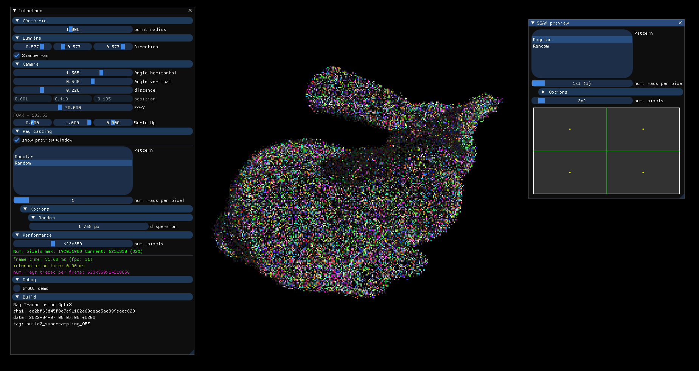

Résultat final

## Matériel

Le programme a a été testé sur une *RTX A4000* ainsi qu'une *GTX 1050 Ti*. Il est en effet possible d'utiliser des cartes non-RTX avec OptiX. Ces cartes ne sont cependant pas optimisées pour et le temps de rendu est beaucoup plus long.

# Ray tracing

Le lancer de rayons ou **ray tracing** est une méthode de rendu alternative à la **rastérisation** (comme OpenGL). Il s'agit de simuler les rayons de lumière *à l'envers*, c'est-à-dire en partant de la caméra. Cela permet un rendu beaucoup plus réaliste et une implémentation des effets beaucoup plus simple. Méthode existant depuis des dizaines d'années, mais qualifiée d'inutilisable car les GPUs de l'époque de ne permettaient pas son rendu en temps réel. Jusqu'à aujourd'hui notamment grâce à la génération RTX de NVidia, la première génération optimisant cette méthode avec un hardware dédié.

On considère une image de taille $(w_\text{i},h_\text{i})$. On lancera un rayon par pixel par image, soit $w_i \times h_i$ en tout ce qui correspond à 2M de rayons pour du full HD $1920 \times 1080$. Le rayon de chaque pixel $r_{i,j}$ aura pour origine la position dans le monde $P_r=(x_r,y_r,z_r)$ et sera tiré dans une direction $N_r=(n_{x,r},n_{y,r},n_{z,r})$ qui dépendront de la caméra. En fait, un rayon n'est ni plus ni moins qu'une *demi-droite*. 

## Caméra

La caméra correspond à l'**observateur**, ce qui sera affiché à l'écran. Ici on considère que la caméra est gérée par les paramètres suivants :

- Où elle se trouve dans le monde : son origine $P_o = (x_o,y_o,z_o)$.
- Vers où elle regarde : le vecteur unitaire $N_o = (n_{x,o},n_{y,o},n_{z,o})$.
- L'angle de vision horizontal $\alpha$ pour une vision en perspective.

L'angle de vision vertical dépendra du ratio $\frac{w_i}{h_i}$ et de $\alpha$ pour ne pas déformer les objets.

Tous ces paramètres peuvent être stockés dans une *matrice de projection*. Ici, stockera directement chaque paramètre car c'est plus adapté au ray tracing. Sinon, les calculs de matrice pour chaque rayons diminuerait les performances.

On peut calculer avec la trigonométrie $N_r$ suivant ces paramètres. Déjà, $P_r=P_o$. Pour la coordonnée écran $X$, on associe à chaque rayon un angle $\alpha_r$ mappé linéairement dans $[-\frac{\alpha}{2}, \frac{\alpha}{2}]$. La cible est alors est $T_r = \tan(\alpha_r)$, et la direction qu'il faut normaliser est $T_r - P_o$. Pour la coordonnées écran $Y$ c'est la même chose avec l'angle vertical.

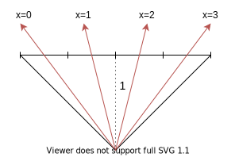

Exemple pour 4 pixels.

## Collisions

Pour chaque rayon tracé, la couleur dépend des objets rencontrés par le rayon. Il s'agit donc de rechercher les collisions avec les objets du monde, chaque objet étant composé de primitives (*triangle, sphère, disque....*). Il existe pour ce faire deux méthodes : soit rechercher les collisions en avançant à intervalles réguliers, soit trouver directement l'intersection. C'est cette dernière méthode qui est la plus utilisée, par OptiX aussi. Il est possible de trouver algébriquement la solution de collision pour les formes simple en un temps constant $\mathcal{O}(1)$ ce qui est adapté pour des performances critiques, indépendemment d'où se trouvent les géométries.

Le but principal du ray tracing est donc de trouver le premier objet intersecté ainsi que la position d'intersection. Concrètement, on cherche le plus petit $t$ pour lequel $P_r+tN_r$ intersecte avec une primitive $Q$. On s'intéressera ici à la collision $(\text{sphere},\text{rayon})$ qui est le principal type de collision dont on aura besoin pour ce projet. Les points de collisions $(\text{sphere},\text{rayon})$ sont obtenables en résolvant une équation du second degré. Cela est intuitivement compréhensible car un rayon peut avoir 2, 1 ou zéro points de collisions avec une droite, le même nombre que de solutions à ce type d'équation. Pour vérifier si la sphère se trouve bien sur la *demi-droite* et non pas la *droite*, il suffit de vérifier que $t\ge0$. Si $t<0$, l'objet se trouve derrière le rayon.


D'autres algorithmes du même type $\mathcal{O}(1)$ sont utilisables pour d'autres primitives.  Pour les disques, il s'agit de rechercher l'intersection avec son plan et vérifier si la distance est inférieure à son rayon.

## BVH

Bien sûr, chercher les collisions avec tous les millions de triangles de la scène n'est pas performant, c'est pourquoi ce calcul est optimisé grâce à une **structure accélératrice** qui permet de partitionner l'espace, restreindre la recherche aux noeuds que l'on traverse et ainsi réduire le temps de calcul. Il existe différentes méthodes comme les *Quad-tree*. OptiX utilise des **BVH** (pour *Bounding Volume Hierarchy*). Il s'agit d'une structure complexe à l'intérieur de laquelle chaque objet doit être inséré et actualisé et chaque changement de position, ce qui entraîne un coût mais est rentable par rapport à l'accélération apportée lors de la recherche des collisions. Pour chaque objet, on calcule une boîte englobante qui contient entièrement l'objet appelée **AABB** (pour *Axis Aligned Bounding Box*) qui est insérée dans une structure en arbre qui optimise la recherche de collision à la manière d'un arbres de recherche. Elle doit être le plus petit possible mais doit contenir **obligatoirement** tout l'objet. Il y aura donc des points de l'AABB en dehors de l'objet. La façon la plus commune de la définir suffit de deux points $A_{\min}$ et $A_{\max}$ qui en définit les limites, car les axes sont alignés avec les axes du monde. L'utilisation d'une AABB permet de d'abord effectuer le test de collision sur celle-ci, un test rapide, avant de tester les collisions avec l'objet contenu, qui peut être plus complexe. En effet, s'il n'y a pas de collision avec l'AABB, on sait qu'il ne peut pas y avoir de collision avec le(s) objet(s) contenu(s).


Pour le nuage de points, l'AABB optimale d'une sphère, en 2D ou 3D, de rayon $r$ et de position $P=(x,y,z)$ est simplement $A_{\min}=P-r$ et $A_{\max}=P+r$.

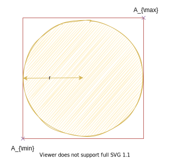

Pour le disque, un [algorithme très simple](https://iquilezles.org/www/articles/diskbbox/diskbbox.htm) permet aussi de la calculer, que l'on peut même étendre aux cylindres et aux cônes.


# OptiX

## API

OptiX est une surcouche CUDA. C'est-à-dire que cette API est directement intégrée à CUDA et l'utilise. Il n'y a pas de bibliothèque à lier en plus, seulement des headers à installer en téléchargeant le SDK. Si OptiX n'est qu'un surcouche CUDA, pourquoi ne pas utiliser directement CUDA ? En plus de fournir les outils pour créer des **BVH**, tracer des rayons et gérer les collisions, OptiX peut *ré-affecter* un thread à un autre rayon ce qui optimise les performances. En effet, il est courant que les rayons ne prennent pas tous le même temps, en fonction des collisions et des rebonds.

La liberté est laissé au programmeur de gérer la mémoire : quasiment aucune mémoire annexe n'est allouée par OptiX. En outre, OptiX ne définit pas les concepts comme ce qu'est un pixel, l'écran, le format de couleur, etc... C'est à l'utilisateur de définir ces concepts. Tout cela en fait une API très *bas-niveau* qui permet une personalisation totale mais est aussi plus compliqué comme cela se fait de plus en plus avec les API graphiques comme Vulkan. La mémoire de la carte graphique n'est pas accessible sur l'hôte et inversement, bien que manipulée comme des pointeurs. Pour simplifier le programme, une classe `managed_device_ptr` de type [*RAII*](https://en.wikipedia.org/wiki/Resource_acquisition_is_initialization) a été écrite qui permet de gérer automatiquement une donnée sur le GPU (allocation + déallocation).

Comme de nombreuses bibliothèques, celle-ci possède des conventions de nommage. Toutes ses macros commencent par `OPTIX_`, les fonctions commencent par `optix` et toutes les classes par `Optix`. Identiquement, toutes les fonctions CUDA commençent par `cuda` (oui parfois `cu` pour l'API bas-niveau).

Dans la démo, la majorité du code OptiX, donc relatif à la pipeline et aux BVH, est situé dans le fichier `main.cpp`. On utilisera la version OptiX **7.4** qui est très différent de la version 6.

## Affichage à l'écran

OptiX ne permet même pas d'afficher quoi que ce soit à l'écran. Elle permet seulement de stocker une image dans un tableau. Il faudra donc interfacer avec d'autres bibliothèques comme OpenGL + GLFW pour voir quelque chose. La clef, et c'est ce qui a été fait ici, c'est à chaque frame d'*uploader* le tableau dans une texture OpenGL et afficher cette texture sur tout l'écran. Pour OpenGL, on sera donc en "2D". La classe `SimpleGLRect` permet de gérer ceci.

Normalement, on devrait récupérer les données sur l'hôte puis les ré-envoyer sur la carte graphique avec OpenGL. Mais pourquoi les ré-envoyer alors que les données se trouvent déjà sur le GPU ? Pour les meilleures performances, CUDA fournit une API d'*interopérabilité* qui permet de lier un tableau CUDA à un objet OpenGL (appelé *Pixel Buffer Object*). Cela réduit les communications CPU ⇔ GPU et améliore les performances. La classe `Pbo` permet de gérer ceci.

## Format PTX

Un programme utilisant OptiX est séparé en deux morceaux de code : le code **host** exécuté sur le CPU (la partie qui possède le `main()`) et le code **device** exécuté par le GPU. Le code host sera exécuté normalement, par le thread principal, et le code device sera exécuté une fois par pixel. La plupart de temps, on monitorera l'exécution sur l'hôte (envoi des paramètres, initialisations...) et la vrai logique de rendu sera sur le **device**. On peut comparer le code device aux shaders OpenGL. Ce code sera du $C\texttt{++}$ standard mais il sera impossible d'utiliser certaines fonctionalités comme la [STL](https://en.wikipedia.org/wiki/Standard_Template_Library). On ne pourra appeler que des fonctions marquées spécialement `__device__`. Il s'agit du même mécanisme qu'avec CUDA. 

De plus, la partie de code relative à la carte graphique sera compilée par le compilateur propriétaire de Nvidia **nvcc**. Ce code sera stocké dans des fichiers **.ptx**, l'équivalent des .o pour le GPU. Ces fichiers contiendront le code dans un language assembleur intermédiaire au format texte., et il faudra les charger et les compiler à **chaque** exécution du programme grâce à la fonction [optixModuleCreateFromPTX()](https://raytracing-docs.nvidia.com/optix7/api/group__optix__host__api__modules.html#ga7097d70b8b0bea06591402734bf56fe7). Ainsi, on suivra un protocole similaire à une phase de compilation - édition des liens mais à l'exécution du programme.


## Pipeline

Ces différents concepts vont être expliqués ici : **Pipeline**, **Program Group**, **Module** et **Program**.

Avant même de lancer des rayons, OptiX permet à la base d'exécuter en parallèle $n$ threads sur le GPU appelés **kernels**. C'est ensuite à l'intérieur de ces kernels que l'on pourra tracer des rayons : la distinction subtile est que chaque kernel n'est pas forcément associé à un rayon, mais doit lancer lui-même le (ou les) rayons.

Pour pouvoir effectuer du ray tracing, il faut d'abord créer une structure `OptixPipeline` qui est comparable à un **programme exécutable** sur le GPU. Une pipeline est une structure hiérarchique avec un concept différent à chaque niveau. Elle est composée de **program groups** eux-mêmes composés de **modules** eux-mêmes composés de **programs**. Une pipeline, comme le nom l'indique, est un assemblage de fonctions qui définit le flux d'exécution du ray tracing.

Le *program* est le concept le plus important et est simplement une fonction. Elle sera exécutée automatiquement sur le GPU comme un `main()` à certain moments. Il existe différent types de programmes qui correspond chacun à un évènement. Ces fonctions doivent **obligatoirement** commencer par un nom particulier. Les plus importants types de programmes sont :

- **Ray generation** : il s'agit du `main()` du kernel sur le GPU. Doit commencer par `__raygen__`. Par exemple, `__raygen__maFonction()` est une fonction de ray generation valide.
- **Intersection** : appelé lors d'une intersection avec l'AABB. Doit commencer par `__intersection__`.
- **Any-hit** : appelé aussi lors d'une intersection avec une primitive. La différence sera précisée par la suite. Doit commencer par `__anyhit__`.
- **Closest-hit** : appelé pour la première intersection. Doit commencer par `__closesthit__`.
- **Miss** : appelé quand il n'y a aucune intersection. Doit commencer par `__miss__`.

Un ensemble de programmes correspond à un fichier source `.cu` (comme `.c` mais sur le GPU), compilés dans un fichier PTX. Un **module** n'est rien de plus que le fichier PTX une fois chargé. Ensuite, un **program group** est créé à partir d'une référence vers un module, le nom du programme d'entrée et le type (*RAYGEN*, *MISS* ou *HITGROUP*) du programme d'entrée. La seule exception est le program group *HITGROUP* qui doit contenir 3 programmes : *any-hit*, *closest-hit* et *intersection*, donc aussi jusqu'à 3 modules différents référencés. On peut créer différents *program groups* à partir du même *module*. Par exemple dans l'application, on aura besoin que d'un seul *module* partagé entre tous les *program groups*.

Une fois que l'on a les *program groups*, on peut créer la pipeline à partir de ces 3 *program groups* *RAYGEN*, *MISS* et *HITGROUP*.  Lors de la création de la pipeline, on doit aussi spécifier les différentes options. Comme par exemple la taille du *stack*, le nombre de paramètres possibles, le niveau de log. La plupart des options étant relatives à l'optimisation. La plupart des paramètres ainsi que la création d'une pipeline ne change quasiment pas d'une application à l'autre et il s'agit de nombreux copier-collers.

On note que nulle part lors de la création de la pipeline, on définit le BVH. Le BVH est complètement indépendant de la pipeline et doit être vu comme une structure utilitaire, que l'on utilisera lors du lancer de rayon avec  `optixTrace()`. Il sera ainsi possible de changer de scène (le BVH) sans recharger la pipeline.

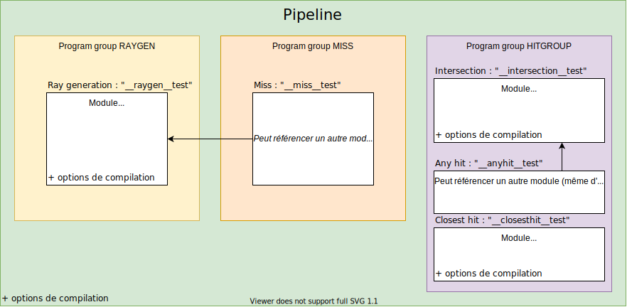

Dans cet exemple, on créé une pipeline à partir de seulement 3 modules, certains contenant plusieurs programmes. Chaque *program group* contient une référence vers un module ainsi que le nom du programme d'entrée. Les options de compilation doivent être les **mêmes** pour la pipeline et chaque module.

## Flux d'exécution


Pour illustrer le flux d'exécution, nous allons prendre un exemple avec les différents cas de figures possibles. Le rayon $r_1$ ne rencontre aucune collision. Le rayon $r_2$ rentre en collision seulement avec l'AABB. Enfin, $r_3$ rentre en collision avec l'objet (et donc forcément l'AABB).


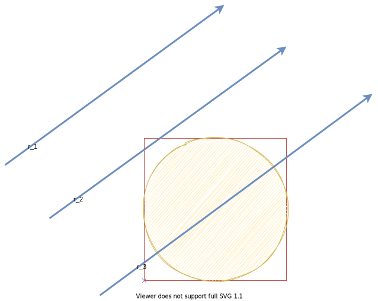


Pour $r_1$, c'est relativement simple : seulement le programme `__miss__` est appelé.

Pour $r_2$, lors de la collision avec l'AABB, c'est le programme `__intersection__` qui est appelé. C'est ce programme qui doit vérifier si oui ou non il y a *vraiment* collision avec l'objet. Il s'agit d'une *broad-phase* qui l'appelle pour filtrer les non-collisions les plus évidentes (avec les AABBs). Ensuite, le programme d'intersection doit vérifier si oui ou non il y a bien collision. Il dispose des paramètres du rayon ainsi que l'indice de la primitive de l'AABB. Ce programme dépend du type d'intersection. C'est ici que pour une sphère, on résoudra l'équation du second degré. On remarque qu'il y a deux points de collision avec l'AABB, mais seulement un seul appel au programme de collision, celui du point d'entrée. Le programme de collision peut reporter plus d'une intersection s'il y en a plus, dans l'ordre de collision. Ici, comme finalement il n'y a pas de *réelle* collision, seul le programme `__miss__`, encore, sera appelé. C'est bien ce que l'on souhaite car en pratique, il n'y a pas de collision avec l'objet.

Pour $r_3$, comme pour $r_2$, le programme `__intersection__` sera appelé. Ici, le programme détectera enfin deux collisions et devra indiquer le $t$ qui permet de trouver les points de collisions. Pour reporter les intersections, il faudra appeler la fonction [optixReportIntersection()](https://raytracing-docs.nvidia.com/optix7/api/group__optix__device__api.html#ga8ef53b8aca3f16a532142ee13f987c2a). A la première intersection reportée, c'est le programme `__closesthit__` qui sera appelé. Ensuite, le programme `__anyhit__`. Enfin, le programme `__anyhit__` sera appelé une deuxième fois lors du report de la deuxième intersection (toujours dans le programme d'intersection).

Parfois, on veut seulement détecter la première intersection, ce que permet un *flag* lors du ray tracing, qui permet d'ignorer les autres et ainsi d'optimiser.

```c++
// Pseudo-code du programme d'intersection
void __intersection__sphere()
{
    float delta = resolve_equation_quadratic(...);
    if(delta > 0)
    {
        optixReportIntersection(t1);
        optixReportIntersection(t2);
    }
    else if(delta == 0)
    {
        optixReportIntersection(t0);
    }
}
```

# Primitive

On appelle *primitive géométrique* la forme que le programme de collision doit détecter. Il s'agit de formes simples. Les *modèles 3D* en tant que tels n'existent pas dans OptiX et ne sont qu'un ensemble de primitives. Les objets complexes sont parfois composés de millions de celles-ci. OptiX ne gère que deux types de primitives de façon native :

- Les **courbes** : elles sont utilisées par exemple pour l'*herbe* ou les *cheveux*. Elles peuvent être implémentées par des courbes de Bézier avec un rayon.
- Les **triangles** : la primitive la plus commune et la plus importante, traditionnellement la seule *vraiment* supportée par les rastériseurs.

OptiX fournit des **modules** pré-compilés possédant un programme d'intersection optimisé pour ces primitives. Dans le cadre du nuage de points, on ne s'intéressera pas à celles-ci, car on a besoin de sphères ou de disques. Comment peut alors détecter ces collisions ? En fait, OptiX supporte un autre type de primitive, appelé **custom**. Il s'agit de primitives définies par l'utilisateur. On les utilisera alors pour définir une primitive de sphère qui n'est pas supporté nativement. Pour définir une primitive personalisée, il faudra fournir 2 éléments :

- Un programme d'intersection. Ici, `__intersection__sphere()`.
- L'AABB de la primitive. Ici, celles des sphères, relativement simple à calculer.

OptiX ne stockera lui-même que l'AABB dans le BVH. Mais pour détecter de façon précise la collision dans le programme d'intersection, nous aurons besoin de données pour chaque primitive, le centre $c$ ainsi que le rayon $r$. La seule donnée accessible dans le programme d'intersection sera l'index de la primitive de l'AABB heurtée. Pour ce faire, il y a différentes méthodes possibles car OptiX laisse la liberté au programmeur de gérer la mémoire lui-même. La façon qui a été faite ici est de stocker sur le GPU un tableau de `Sphere`, indexé de la même manière que les primitives, auquel on pourra accéder dans le programme d'intersection. On aura ainsi accès aux données que l'on souhaite. Par exemple, si le modèle possède $10000$ points, il y aura un tableau de $10000$ entrées, et OptiX stockera dans le BVH $10000$ AABBs.

Un BVH ne supporte qu'un seul type de primitive. Il est toutefois possible de supporter plusieurs types de primitives en liant deux BVH dans un arbre de BVH (appelé alors *Instance Acceleration Structure* ou IAS).

## Passage des paramètres

## Exécution de la pipeline

Pour exécuter une pipeline, on devra copier à chaque rendu une structure *readonly* sur le GPU. Elle contiendra toutes les informations nécessaires. Elle est implémentée dans la classe `Params` du fichier `ray.cuh`. C'est la fonction `optixLaunch()` qui permettra d'exécuter la pipeline. A la manière de CUDA, on pourra exécuter $n$ threads en parallèles, mais indexé en 2D ou en 3D.

Ensuite, on aura besoin de passer des paramètres à différentes étapes du flux de la pipeline. 

## Shader Binding Table

## Record

La **SBT** contient des paramètres **globaux** pour tous les programmes d'une pipeline, et est spécifiée lors de son linkage. La **SBT** est un tableau de **Record**. Ici, il nous suffira d'un seul Record. Un Record est un bloc de donnée séparée en deux parties : le **header** est remplit par OptiX, suivi des **données utilisateurs** qui peut contenir ce que l'on veut. Le header est opaque pour l'utilisateur, et est remplit grâce à la fonction `optixSbtRecordPackHeader()`. OptiX requiert que le header soit aligné, c'est-à-dire que son adresse soit un multiple de `OPTIX_SBT_RECORD_ALIGNMENT`. OptiX nous informe la taille du header avec la macro `OPTIX_SBT_RECORD_HEADER_SIZE`, que l'on peut stocker dans un tableau de cette taille, en pratique avec des `char` . Pour aligner les données, la méthode la plus simple est d'utiliser `alignas` du $\verb!C++11!$.

```c++
struct Record
{
  	alignas(OPTIX_SBT_RECORD_ALIGNMENT) char[OPTIX_SBT_RECORD_HEADER_SIZE] header;
    
    int maDonne;
    float monAutreDonnee;
    double etc;
};
```

Pour pouvoir stocker n'importe quel type de donnée `T`, on peut utiliser les templates. C'est ce qui est fait dans le fichier `Record.hpp`.

```c++
template<typename T>
struct Record
{
  	alignas(OPTIX_SBT_RECORD_ALIGNMENT) char[OPTIX_SBT_RECORD_HEADER_SIZE] header;
    
    T user;
};
```


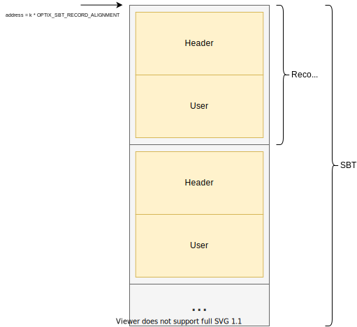


Chaque type de *program group* possède sa propre SBT. Par exemple, pour passer le tableau des sphères du nuage de points, on pourra soit passer par le pointeur en paramètres de pipeline, soit par la SBT, ce qui a été fait dans la démo. Il faudra bien sûr que le pointeur pointe vers une donnée située sur le GPU et non sur le CPU. Ce tableau pourra être alloué avec CUDA, dans la démo en utilisant `managed_device_ptr`.

Dans un *program*, on peut récupérer un pointeur vers la SBT avec `optixGetSbtDataPointer()`, qui renvoit un pointeur vers le début des données **utilisateurs** de la SBT. Il faudra faire attention, car si on stocke un pointeur dans le Record, il faudra effectuer une indirection de pointeurs *deux fois*.

```c++
void *sbt = optixGetSbtDataPointer();
Sphere *spheres = *(Sphere**)sbt;

// Ou encore
Sphere *spheres = *reinterpret_cast<Sphere**>(sbt);
```


## Paramètres de type *payload*

La fonction permettant de lancer des rayons dans un kernel est `optixTrace()` et prend des paramètres copiés en entrée et en sortie appelés **payload**. Le nombre de paramètres doit être précisé lors du linkage de la pipeline. Le plus souvent, le programme *closest-hit* stockera la couleur du rayon dans la payload. On récupère la première payload par `optixGetPayload_0()`, ainsi de suite.

## Paramètres de type *attribut*

Le programme d'intersection peut aussi passer des paramètres au programme *closest-hit* ou *any-hit* de la même façon que les payloads, appelés **attributs**. Par exemple, pour les triangles, ceux-ci seront ses coordonnées barycentriques. On récupère le premier attribut par `optixGetAttribute_0()`, ainsi de suite.

## Notes sur l'implémentation

OptiX étant un modèle très bas niveau, les *payloads* et des *attributs* ne supportent que des entiers 32 bits. Il est cependant possible de *hacker* le fonctionnement et passer d'autres types. Il est aussi possible de passer des pointeurs vers des variables locales. Un pointeur supporté par CUDA étant au maximum 64 bits, il suffit de séparer le pointeur en deux entiers 32 bits et passer ses valeurs, par exemple en séparant les bits de poids fort et ceux de poids faible.

# Nuage de points

Un nuage de $n$ points $P$ est un ensemble de points dans l'espace : $\forall i \in [0;n), P_i = (x_i, y_i, z_i)$
D'autres propriétés sont aussi présentes pour certains modèles : une couleur $C_i=(R_i, G_i, B_i)$ une normale $N_i=(x^n_i, y^n_i, z^n_i)$, ainsi qu'une intensité $k_i$. L'intensité correspond à l'intensité du point prise lors de la capture 3D du modèle physique.

Le format de fichier utilisé ici est le **PLY**. Ce format supporte différentes formes de données, textes ou binaire pour prendre moins d'espace, et la bibliothèque *tinyply* sera utilisée pour les charger.

Le rendu de points dans l'espace est un problème encore aujourd'hui. Il est possible de d'abord transformer celui-ci en *mesh* grâce à une triangulation. Pour ce projet, il est demandé de ne **pas** transformer le nuage de points et de l'afficher comme tel.

Il est difficile d'afficher les nuages de points pour une raison simple : si un point est affiché par un pixel, et si le modèle n'est pas assez dense, le rendu sera majoritairement vide. En effet, théoriquement, les chances de collision entre un rayon et un point sont **nulles**. C'est pourquoi chaque point sera affiché par une sphère de rayon $r_i$ . On définit un rayon de base constant arbitraire $r_b$ et on pondèrera le rayon de chaque sphère par l'intensité du point. Quand le modèle possède une intensité, on définira $r_i=k_i \times r_b$ . Sinon, on définira $r_i=r_b$. Une autre primitive communément utilisée est le disque, orienté suivant la normale du nuage de point.

La position des points sera normalisée dans l'espace $[-1;1]^3$ suivant la boîte englobante du modèle.

On pourra modifier dynamiquement la taille des points dans l'interface avec pourcentage $p$. On observe pourquoi il faut que l'AABB contienne entièrement l'objet ici : quand $p>1$ , la sphère n'est plus intégralement contenue dans l'AABB et apparaît comme une sphère tronquée. Elle apparaît comme un cube à partir de $d=\sqrt 3$, la longueur de la diagonale du carré circonscrit à la sphère.

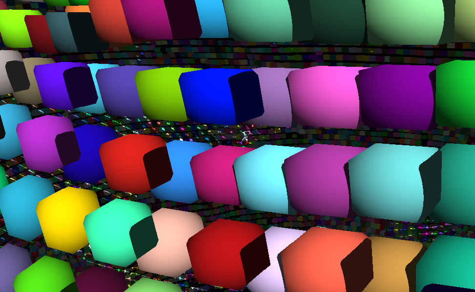

Exemple avec $p=1,597$.

On a attribué à chaque point du nuage une couleur aléatoire.

A chaque intersection, on donne un effet de lumière s'il le point se trouve dans l'ombre. Pour ce faire, on tire un deuxième rayon appelé *shadow ray* qui vérifie s'il y a une intersection vers la lumière. Dans ce cas, on divise la couleur par une constante. Ce modèle n'est pas très physique mais on voit bien les ombres. Il est possible de tirer plusieurs rayons dans une direction aléatoire pour avoir un effet de dégradé des ombres.

# Anti-aliasing

Pour avoir un meilleur rendu, il est possible de ne tirer non pas un mais *plusieurs* rayons par pixels. Cette méthode est connu sous le terme **Supersampling Anti-aliasing**. Pour un pixel $(x, y)$, on tire $d$ rayons. On obtient alors un ensemble 3D de rayons $r_{x,y,d}$. La couleur finale est la moyenne des couleurs obtenues pour ce pixel $\sum_{i=1}^d \frac{r_{x,y,i}}{d}$ . Il est aussi possible de pondérer le poids pris par chaque rayon par rapport à leur distance au centre du pixel.

On considère qu'une fonction de *pattern* permet de calculer cette distribution. Il s'agit d'une fonction $S(i)$ qui donne la position $(\Delta x, \Delta y)$ du $i$-ième sous-rayon pour un pixel donné. Les coordonnées $(\Delta x, \Delta y) $ sont normalisées dans l'intervalle $[0;1]^2$, $0$ étant le coin en bas à gauche du pixel et $1$ le coin en haut à droite.

La plus simple est un *pattern* régulier, où on divise le pixel en une grille 2D. Cela revient à afficher la scène dans une résolution supérieure à l'affichage puis réduire l'image en interpolant linéairement les pixels entre eux à la résolution de l'écran. On obtient le même résultat que sans SSAA dans le cas où il n'y a un seul rayon car il est situé au centre. On fera attention à ne pas toucher les bords et laisser donc une marge de $\frac{1}{2d}$, sinon les rayons aux bords de pixels adjacents auraient la même direction. Si les rayons tirés quand on divise la résolution par $k$ et qu'on multiplie le nombre de rayons par $k^2$ sont les mêmes, le résultat sera différent car les rayons seront interpolés.

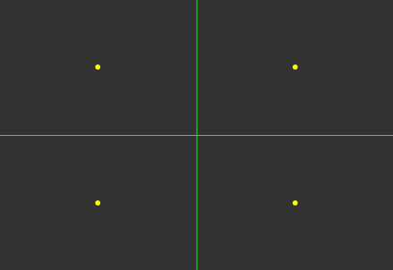

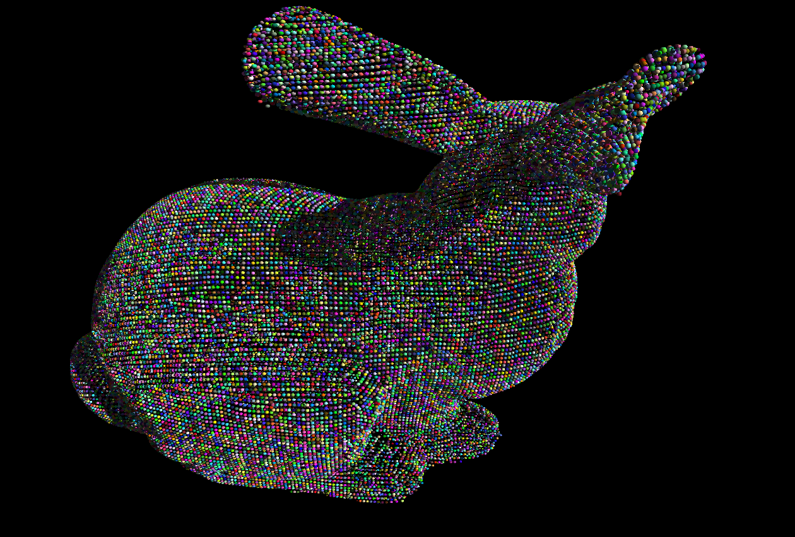

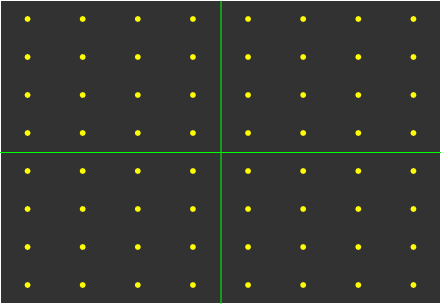

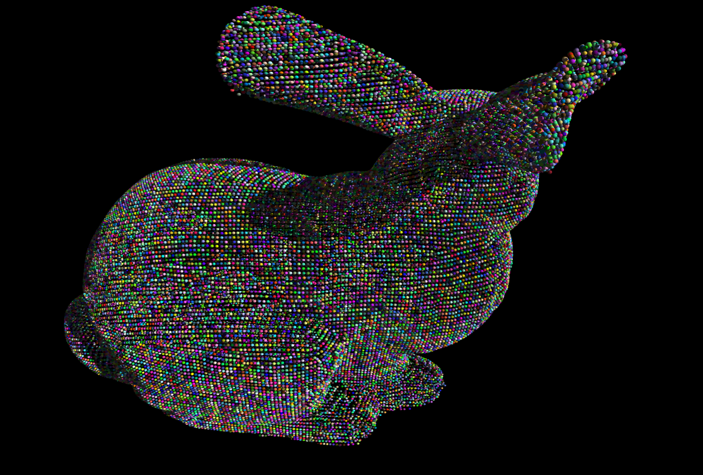

Ici, chaque carré vert représente un pixel et en jaune le rayon. En haut, on tire un seul rayon par pixel (sans SSAA). En bas, on tire 16 rayons par pixels.

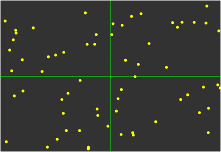

On peut utiliser une méthode aléatoire : tirer un pixel au hasard. On note que le résultat final dépend peu du nombre de rayons ici, car la couleur converge avec le nombre de rayon vers la moyenne de la couleur de ce pixel quand il y a une infinité de rayons. On appelle la dispersion $v$ le paramètre qui permet de condenser plus au moins les pixels autour du centre. La bonne valeur est $v=0,5$ pour qu'un rayon ne puisse pas touche ses voisins. Avec une bonne distribution, on ne devrait pas pouvoir déduire les bords des pixels s'ils ne sont pas mis en valeur comme ici, ce qui n'est possible qu'avec cette valeur de $v$. Avec cette méthode, chaque image rendu est différente, contrairement au pattern régulier.

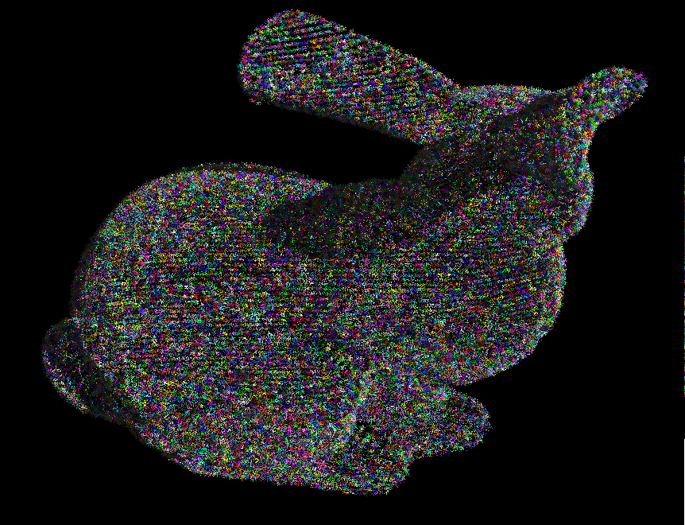

Comme ici, quand $v$ est trop grand ($v=1,765$), il y a comme un bruit blanc.

Il est aussi possible de raffiner ceci en utilisant **Monte-Carlo** pour avoir un meilleur échantillonnage pour éviter que deux rayons soient trop proches, en retirant le rayon s'il est trop proches d'autres, appelée disque de Poisson. Il faudra faire attention à ne pas tirer plus d'un certain nombre de rayons car il est possible qu'il n'y ai plus de place pour en ajouter d'autres ce qui impliquerait une boucle infinie. Les *disques* de Monte-Carlo n'ont pas encore été implémentés et sont la méthode la plus utilisée pour le SSAA.


## Performance

La méthode choisie affecte les performances. Actuellement, la démo recalcule le pattern pour chaque rayon à chaque image. Une optimisation possible serait de précalculer un certain nombre de *patterns*, par exemple 128x128, et prendre pour chaque pixel, à chaque image, un pattern aléatoire. Cela offre plusieurs avantages : les *patterns* n'étant calculés qu'une seule fois, les performances seraient les mêmes quelque soit ceux-ci. On pourrait aussi à la main télécharger des patterns pré-faits ce que certains sites offrent. Pour multiplier artificiellement le nombre de *patterns*, il est aussi possible d'effectuer une rotation, les plus simples à effectuer étant les symétries horizontales et verticales.

On fait la distinction entre les méthodes qui ont besoin de l'indice $(i, j)$ du rayon en 2D (comme le pattern régulier) et celles qui ont seulement besoin d'un indice 1D $i$ (en fait toutes les autres). On peut simplement transformer un indice 1D $i$ en 2D $(x, y$) si l'on connait la longueur d'une ligne $w$  : $(x,y) = (i \mod w, \lfloor{\frac{i}{w}}\rfloor)$. Pour le SSAA, on considerera que $w=\sqrt d$, et on ne supportera qu'un nombre de rayons $d$ carré pour que $\sqrt d$ soit entier.

Pour la *RNG*, un générateur pseudo-aléatoire déterministe de type *Xorshift* est utilisé. La fonction `rand()` ne peut pas être utilisée, car le calcul est effectué sur GPU et cette fonction n'y est pas appelable. En effet, l'état est actualisé à chaque appel et dépend donc du précédent appel, mais sur GPU les calculs sont effectués en parallèle, donc il faut un état par rayon. La bibliothèque **cuRAND** a donc été utilisée ce qui permet ceci. Il serait possible d'utiliser `rand()` si l'on précalcule les patterns. Dans l'idéal, on ne devrait pas non plus car il serait aussi possible de paralléliser l'initialisation en utilisant CUDA.

# Optimisation

Plusieurs éléments ont été testés pour optimiser le rendu. N'ayant pas de carte RTX, j'ai essayé de réduire le coût de certaines phases pour éviter que l'application de se fige.

## Streams

La nature *embarassingly parallel* du lancer de rayon est propice à l'utilisation de streams CUDA. Après les avoir essayé, il n'y a aucune amélioration. On peut supposer que le hardware est déjà optimisé pour, car chaque donnée est indépendante.

## Interpolation

Pour faire la moyenne des sous-pixels pour le SSAA, il y a deux méthodes possibles :

- En 2D : Soit lancer $w_i \times h_i$ kernels et faire une boucle dans chaque kernel et y lancer $d$ par kernel. Cela rend les choses simples car on a accès a tous les sous-rayons ce qui est utile pour Poisson.
- En 3D:  Soit lancer $w_i \times w_h \times d$ kernels et lancer 1 rayon par kernel, puis interpoler les données dans un autre kernel CUDA.

Il a été fait attention à que les couleurs des sous-rayons soient contigües en mémoire pour exploiter la **data locality**. Quand les données sont compacts, le processeur n'a qu'à regarder qu'une seule zone mémoire, évite de charger d'autres pages mémoires (*page fault*) et les performances sont ainsi améliorées.

| [1920x1080, 64 rayons/px] | 2D     | 3D     |
| ------------------------- | ------ | ------ |
| RTX                       | 60ms   | 2000ms |
| non-RTX                   | 2200ms | 2000ms |

Le temps du kernel d'interpolation est très bas (quelques millisecondes), mesuré grâce à **Nsight systems**. Cela donnait à tort des meilleurs résultats sur une carte non-RTX, mais est drastiquement moins performante sur une carte RTX, ce qui peut se comprendre au vu de la différence de hardware.

## Résolution

Ce n'est pas à proprement parler une optimisation mais plutôt un ajustement. On peut réduire la résolution du lancer de rayons pour permettre de rester sur 60 images / sec. sur une GPU moins puissante et rester interactif. Pour éviter de réallouer les *buffers* à chaque changement de résolution, on alloue initialemement un buffer de la taille maximum possible (1920x1080), que l'on ré-interprète comme un tableau plus petit quand on change la résolution. Chaque ligne de pixels étant contigüe en mémoire, on ne peut pas prendre qu'une partie du tableau sinon il y aurait des "trous" ce qui entraînerait un décalage dans les lignes lors de l'affichage. La classe `core/utility/ArrayView.cpp` permet ce travail et interpréter un tableau 1D comme un tableau n-dimensionnel.

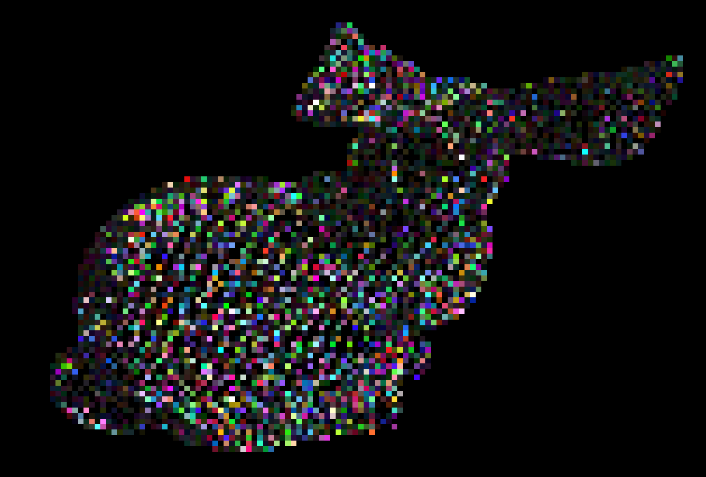

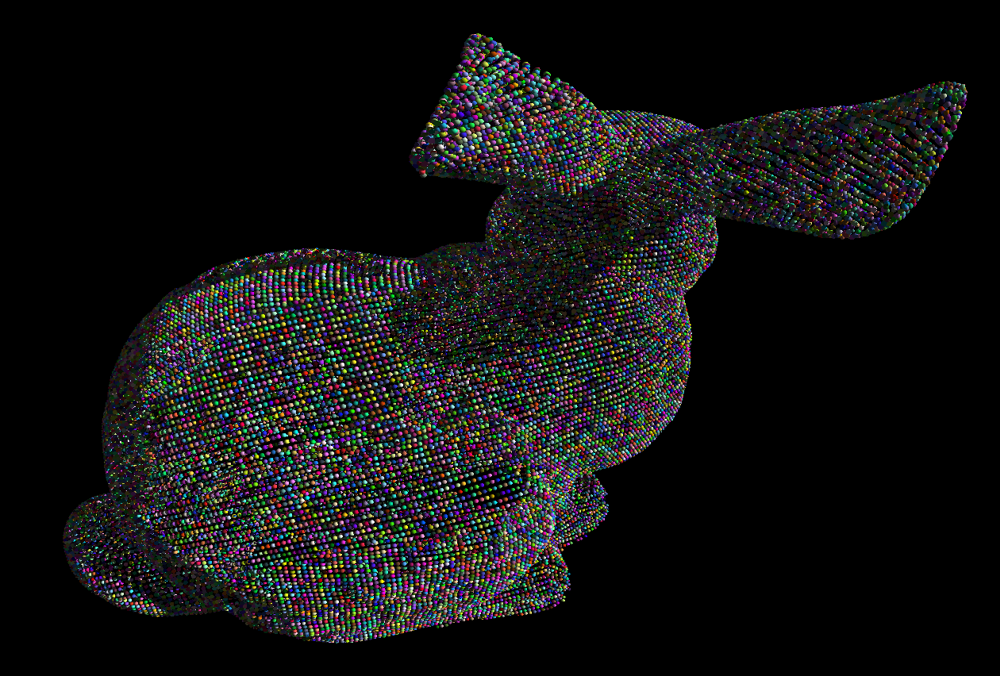

Lors de l'affichage, les pixels affichés ne sont pas interpolés pour bien voir la délimitation de chaque pixel interne.

# Pour aller plus loin

La démo est bien avancée, mais il y aura d'autres choses à faire.

- Pattern en disque de Poisson
- Cacher les patterns
- Expérimenter d'autres primitives comme les disques

# Conclusion

Ce projet m'a permis de comprendre les enjeux et le fonctionnement du ray tracing qui est pour beaucoup l'avenir du rendu 3D. J'ai pu expérimenter l'API OptiX avec une application de rendu du nuage de points mais aussi en en expérimentant d'autres aspects comme le SSAA. L'application créé est fonctionnelle et le code documenté permet de fournir un exemple de l'utilisation d'OptiX.

# Références

- Format PLY : http://paulbourke.net/dataformats/ply/
- tinyply : https://github.com/ddiakopoulos/tinyply
- OptiX 7.4 doc : https://raytracing-docs.nvidia.com/optix7/guide/index.html#preface#

